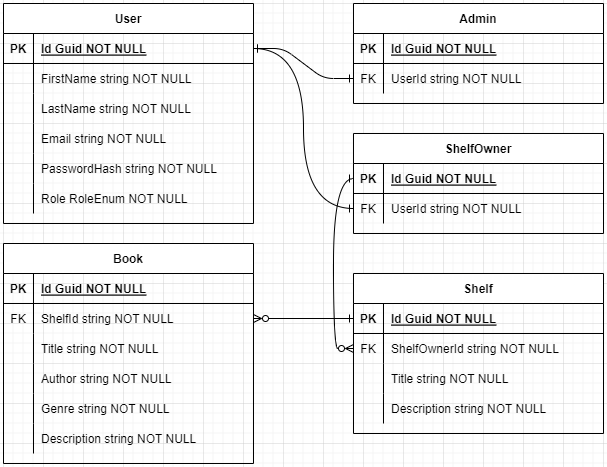

# BookshelfBuddy API

## Description

This simple application allows users to search for books and save them to a database. Users can also view their saved books and delete them from the database.

Books are divided into shelves. Users can add books to a shelf, move and remove them from a shelf. Users can also create new shelves.

## Table of Contents

- [BookshelfBuddy API](#bookshelfbuddy-api)
  - [Description](#description)
  - [Table of Contents](#table-of-contents)
  - [Setup](#setup)
    - [Clone Repository](#clone-repository)
    - [Database Creation](#database-creation)
    - [Running the API](#running-the-api)
    - [Register and Login](#register-and-login)
  - [Endpoints](#endpoints)
    - [Books](#books)
    - [Shelves](#shelves)
  - [Database Diagram](#database-diagram)

## Setup

### Clone Repository

Clone the repository to your local machine using the following command:

```bash
git clone https://github.com/tbtiberiu/BookshelfBuddy.git
```

### Database Creation

1. Open Solution in Visual Studio
2. Open Package Manager Console
3. Run `Update-Database` in the Package Manager Console
   ```
   PM> Update-Database
   ```

### Running the API

Run the API from Visual Studio (`F5`).

A console window will open and display the port the API is running on.

Open a browser and navigate to `localhost:7027/api/swagger/index.html` to view the Swagger UI for the API.

### Register and Login

Before using the API, you need to register a user and log in. Users can have roles of either `ShelfOwner` (0) or `Admin` (1).

To register a user, navigate to the `POST /api/Users/register` endpoint and click the `Try it out` button.

Enter the following JSON in the `Request body` section:

```json
{
  "firstName": "John",
  "lastName": "Doe",
  "email": "test@example.com",
  "password": "test",
  "role": 0
}
```

Click the `Execute` button to register the user.

To log in, navigate to the `POST /api/Users/login` endpoint and click the `Try it out` button.

Enter the following JSON in the `Request body` section:

```json
{
  "email": "test@example.com",
  "password": "test"
}
```

Click the `Execute` button to log in.

The response will contain a `token` that you can use to authenticate requests for the shelf owner created.

To authenticate requests, click the `Authorize` button at the top of the Swagger UI.

Enter `bearer <token>` in the `Value` field and click the `Authorize` button.

The `token` will be automatically added to the `Authorization` header for all requests.

Now you can use the API to search for books, create shelves, add books to shelves, move books between shelves and delete books from shelves.

## Endpoints

### Books

- `GET /api/Books` will return all books in the database.

- `GET /api/Books/{id}` will return the book with the specified id.

- `POST /api/Books` will add a book to a shelf.

- `PUT /api/Books` will update the book specified.

- `DELETE /api/Books/{id}` will delete the book with the specified id.

### Shelves

- `GET /api/Shelves` will return all shelves in the database.

- `GET /api/Shelves/{id}` will return the shelf with the specified id.

- `POST /api/Shelves/admin` will add a shelf to the database for the admin user.

- `POST /api/Shelves/shelfOwner` will add a shelf to the database for the authenticated user.

- `PUT /api/Shelves` will update the shelf specified.

- `DELETE /api/Shelves/{id}` will delete the shelf with the specified id.

## Database Diagram



[Back to Top](#bookshelfbuddy-api)
